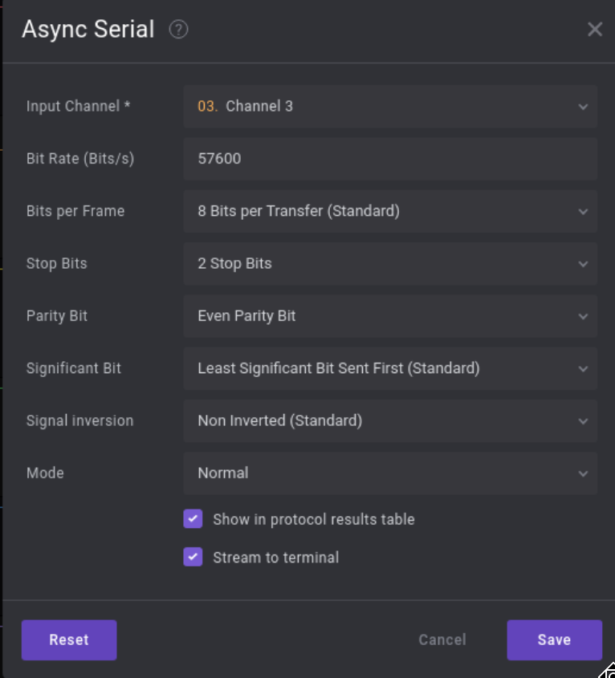

The participant can view the provided file using saleae logic analyzer software and they can identify that it is a UART communication by observing the signal. They should also find baud-rate by observing the duration of a single bit.
	
Analyse the frame structure to find the correct settings for stop bits and bits per frame
Correct settings:
	
